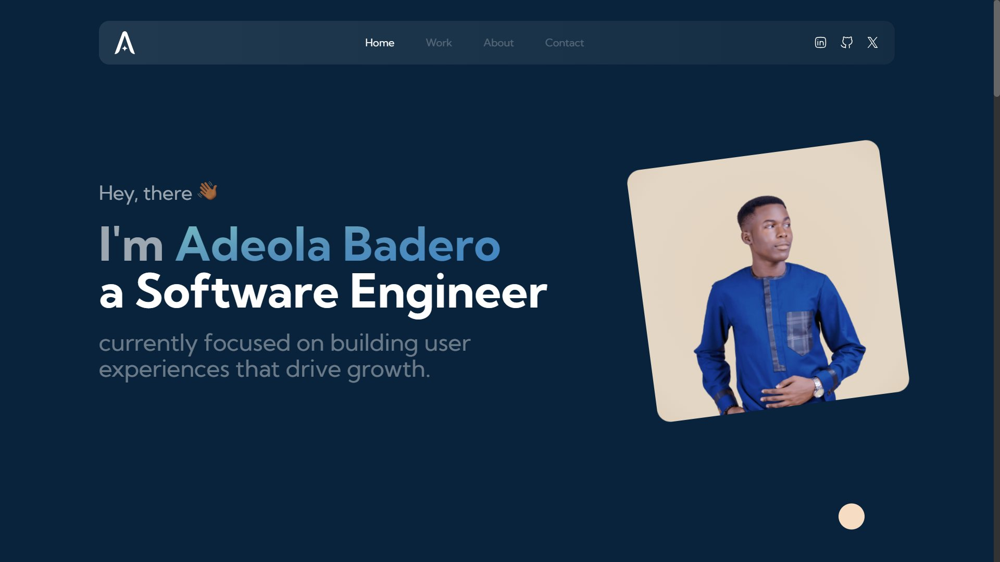
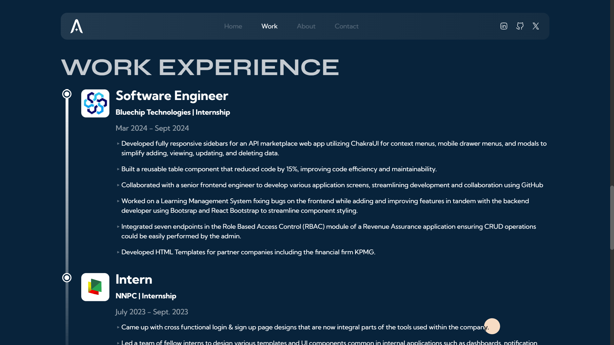
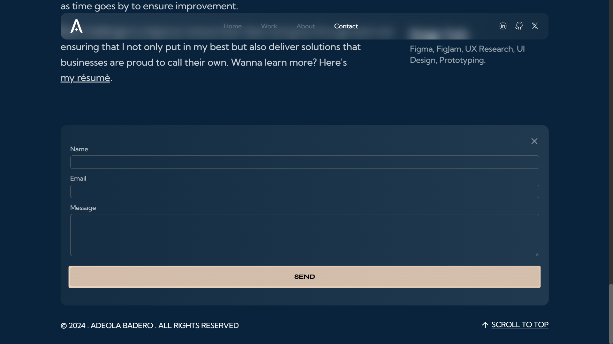

# Portfolio Website — v1

My name is Adeola Badero, a Frontend Software Engineer & Web designer based in Lagos. I enjoy crafting websites that aid business growth and software that makes lives easier; Honing technology, to better ease lives and improve the world I live in.

I created this website to showcase my capabilities on the frontend, and to deepen my understanding of framer motion. I learnt certain things building this site and by going through the code you stand a chance to learn new things too and better improve your frontend skills.

# Tech Stack

Technologies: React, Next.js, Typescript, Tailwind, React-hook-form, Email.js and Framer Motion <br>
Hosting: Netlify

# Gallery



<!--  -->


[View Live Demo](https://adeolabadero.netlify.app)

# Get started

Clone the project

```
git clone https://github.com/adex-hub/ade-folio.git
```

Go to the project directory

```
cd ade-folio
```

Install dependencies

```
npm install
```

Start the development server

```
npm run dev
```

# Contribution and usage

This is an open source project, hence you're welcome to use the code or parts of the code for your own site. When using this project, make tweaks to various components and the theme to really make it your own. Finding it hard to come up with a good color pallete? [Here is a good start!](https://mycolor.space)

If you're not modifying the design much, credit me as the designer of the website.

If their any concerns or questions in the user of my work, please reach out to me on [X/Twitter](https://x.com/Ade_the_great) or [LinkedIn](https://linkedin.com/in/adeola-badero). I'd be happy to help out as much as I can.

# Feedback

Although I'm currently not accepting PRs (pull requests), I encourage you to reach out to me to share and discuss possible suggestions or improvements that I can make to the site. Say hello on [X/Twitter](https://x.com/Ade_the_great) and let's talk, as your feedback means growth and improvement for this project and for other people who would be inspired by this work to create their portfolios in the future.

# License

This project is licensed under the MIT License - see the [LICENSE](LICENSE) file for details.
